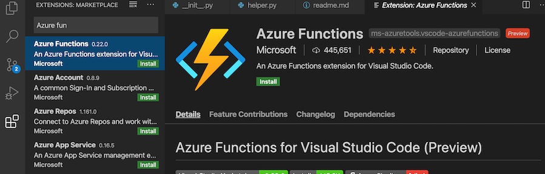
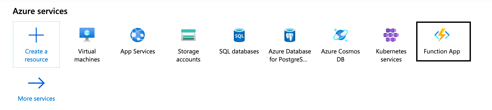
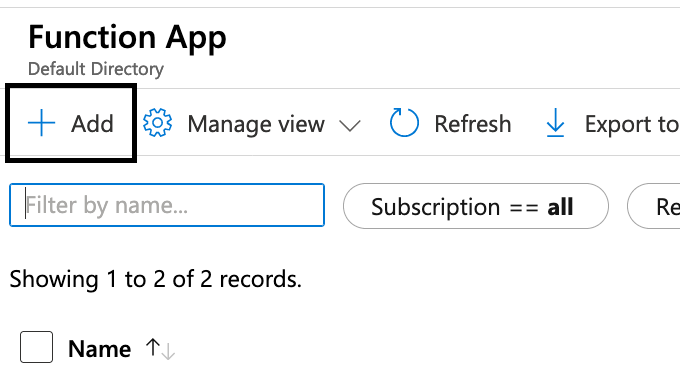
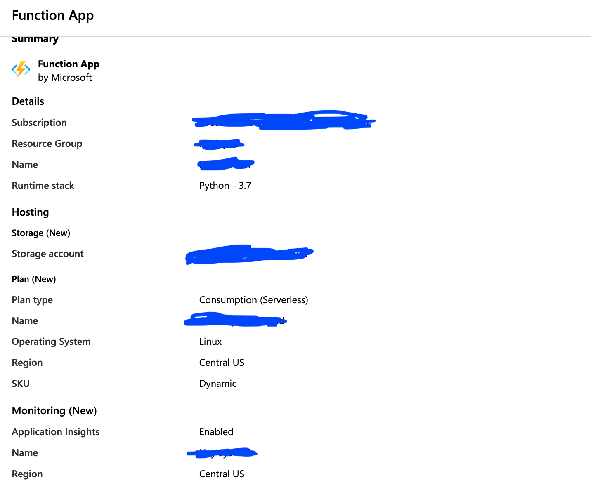
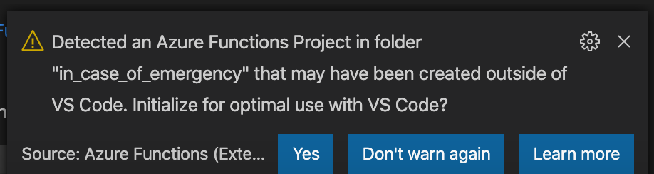
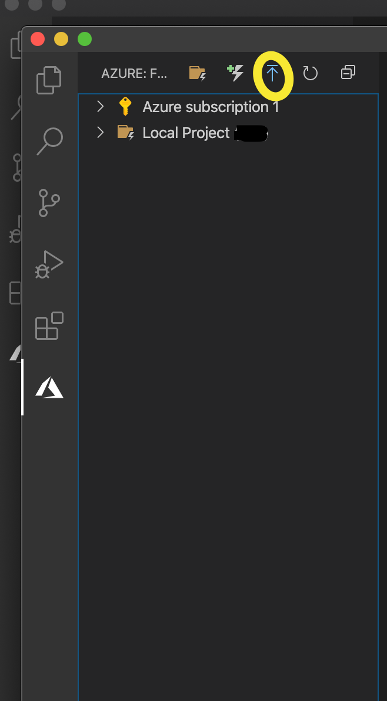
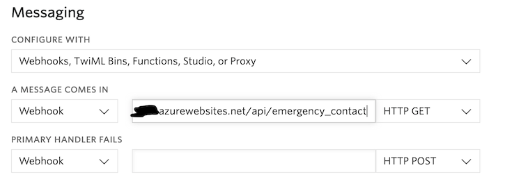
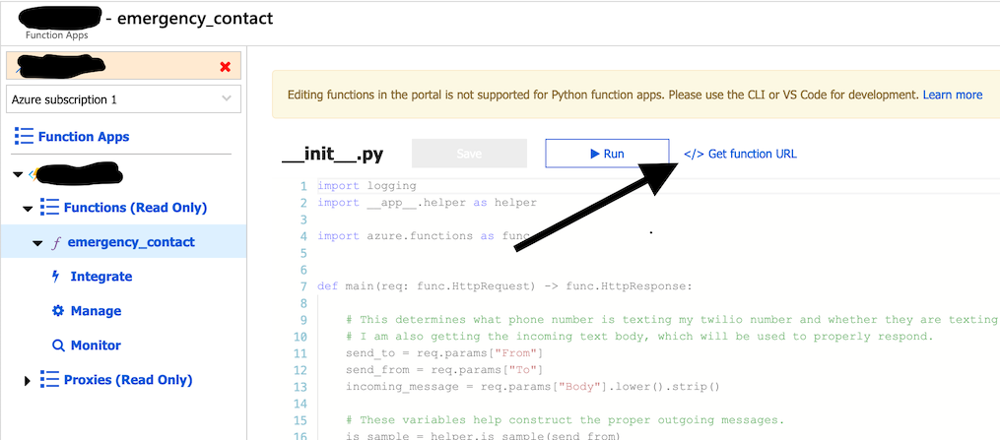
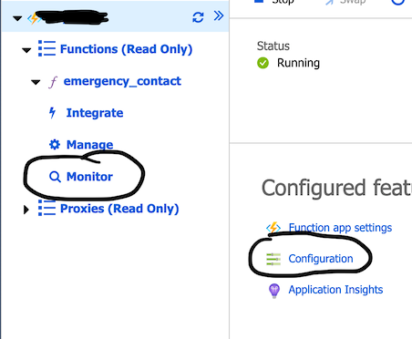
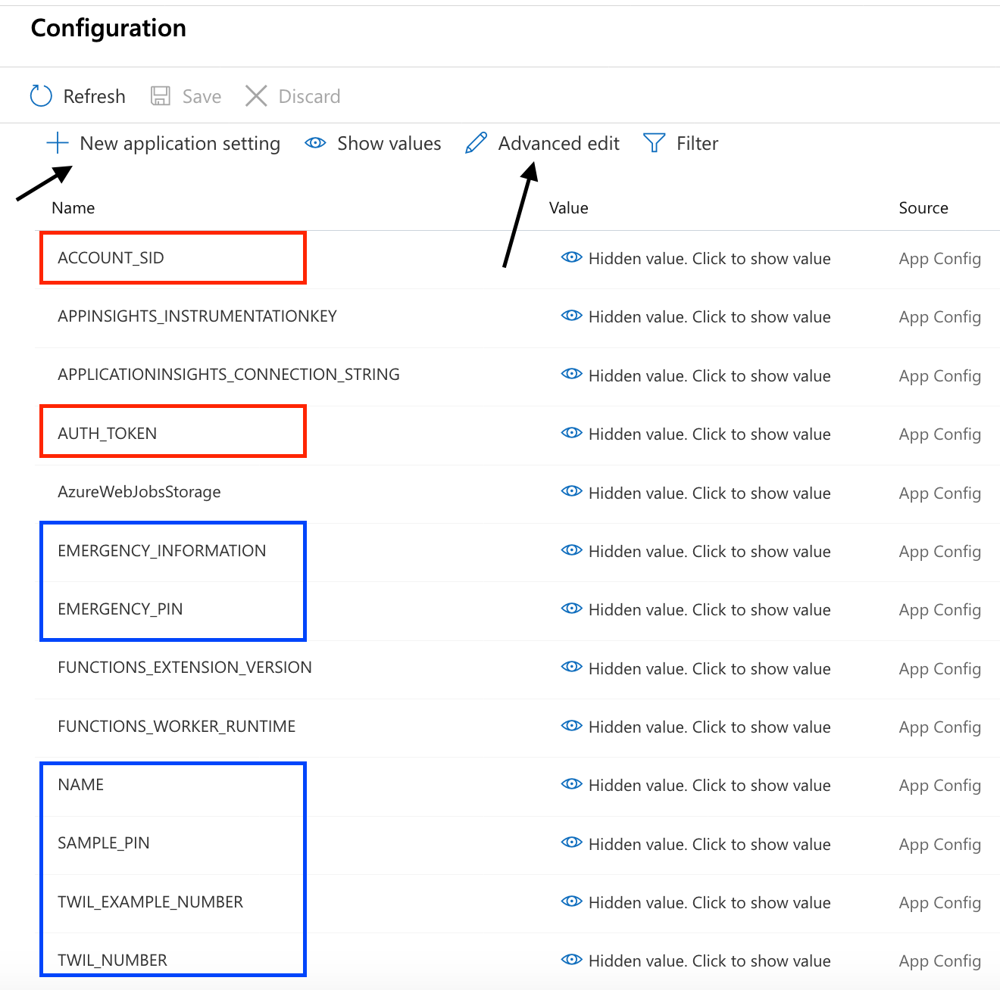

## Implementation

{: .important }
The screenshots on this page are likely out of date. The overall setup should be very similar, but I believe both Azure and Twilio have likely made UI changes since 2020. 

Could you use something like this in your life? You can get your own. You will need:

1. An Azure account.
2. A Twilio account and a Twilio phone number.
3. To clone my [GitHub repository](https://github.com/hayleycd/in_case_of_emergency) and make any changes to the code to suit your situation.

### Steps to success with Azure

>Azure recently updated their UI, so some of these images are slightly out of date. Currently you can use the old UI, look for the informational alert. 

- Sign up for your free [Azure account](https://azure.microsoft.com/). You will get some credit to try it out for a month. 
- Download [VS Code](https://code.visualstudio.com/) and the [Python](https://marketplace.visualstudio.com/items?itemName=ms-python.python) and [Azure Functions](https://marketplace.visualstudio.com/items?itemName=ms-azuretools.vscode-azurefunctions) extensions.

- Authenticate your Azure account in VS Code. Once you have installed the Azure Functions extension, you should see a notification on the extension tab that will help you through the process. Now your VS Code install and your Azure account are connected. 
- Create a new Azure Function App through the Azure Portal in your webbrowser. 

  - Click functions to navigate to all of your Functions Apps. 

  - Add a new Function App. 

- Configure the settings for your new App. The defaults should be sufficient, though check your region. Here is the summary of my setup before I deployed a trial function app. (This screen shot is not from _this_ specific project.)

- Once you feel good about the settings, deploy! Azure will take a minute to deploy your app. 

- In VS Code, open the file containing the repository that you cloned and pulled down from my GitHub. VS Code should detect that you have a Azure function application. Follow any prompts that it may give you. 

- You will need to deploy your local project (the project you cloned from my repository) to your Azure Function App. You do so by clicking the button in VS Code that is indicated in the image below. (It is the upload button. This will also be used to deploy any changes you make in the future.)

- When prompted, select the Azure Function App you just created and deploy!

### Twilio account and phone number
Once you have a [Twilio account](https://www.twilio.com/try-twilio/), you need to purchase and set up a Twilio phone number. 

You will want your phone number to behave in a certain way when someone texts you. Here is what it looks like to set it up:

When the number is sent a message, a GET request is made to my Azure function endpoint. I have obscured my URL, but if you want your own you can find yours in your Azure Function UI as shown:

 

### Environment variables
Once you have the basic set up in Azure and Twilio, you will need to populate your environment variables. When you are viewing your Azure Functions application in your Azure Portal, you will be able to configure your function (add environment variables). The link to that functionality is circled in the picture below. I have also circled where you can monitor your function. This will be particularly useful to troubleshoot any issues you may have with the environment variables, etc. 

 
The image below shows what you will find when you are configuring your function. The variables that are not circled come pre-populated. 

 

You can add and edit variables by clicking the links indicated by the arrows in your configuration UI. Variables indicated in red should be found in your Twilio account (AUTH_TOKEN and ACCOUNT_SID) and are necessary to use the Twilio API. The variables indicated in blue you will need to create, and include things like your Twilio number, etc.

The trickiest environment variable is EMERGENCY_INFORMATION. It can be long and, if not formatted properly, can be a problem. It must be in JSON format. Don't add a single quote to the outside of the structure. _Only_ use double quotes, JSON doesn't understand single quotes. You can take the template below and populate it with your information. 

    {
    "meds": [
        ["Med A: ", "Notes for A"], 
        ["Med B: ", "Notes for B"]
        ],
    "details":[
        ["Blood type: ", "Blood Type"], 
        ["Allergies: ", "Allergies"], 
        ["Other information: ", "Other health information"]
        ], 
    "contacts": [
        ["Contact 1", "Contact 1 number"],
        ["Contact 2", "Contact 2 number"]
        ]
    }

When you are done adding variables, you will need to save them before they will be applied to your function. 

### Let me know!

If you give the above a try, please let me know. I would love to hear from you and can be contacted most readily on [Twitter](https://www.twitter.com/hayleydenb).

