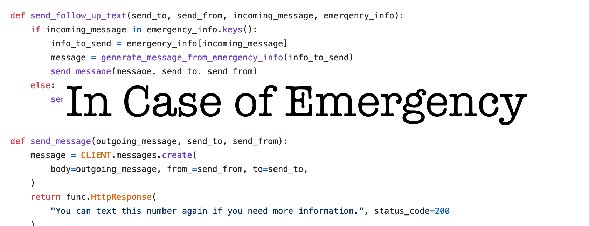

 

{: .note }
This project is no longer deployed. you will not be able to try it for yourself. It is now only a writing and code sample. 

## My application

Introducing _In Case of Emergency_, the Twilio app that makes it easy to keep emergency contact information up to date! I can also customize my information, making sure not to leave out anything

## Features

_In Case of Emergency_ provides the following via text to emergency personnel or a Good Samaritan who finds you in need:
- Medically relevant information(allergies, known conditions, blood type, anything that you personally would want a doctor to know in an emergency)
- Medications and any relevant dosing information
- Names and phone numbers of your emergency contacts 

Best of all, you can keep all of your information current by editing the relevant environment variables in Azure Functions. You can always add an item to your list of meds. You can remove an item from your medical details when it is no longer relevant (for instance: pregnancy, injury, ). Add and edit contacts with ease. 

## License
This project is licensed under the MIT License. License text can be found [here](https://github.com/hayleycd/in_case_of_emergency/blob/master/license.md)
