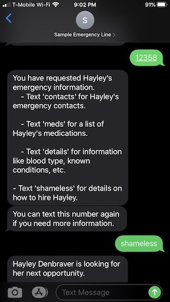

## Try it out!

I want to demonstrate my project, but I _do not_ want y'all to have access to my medical details or my emergency contacts. Boundaries are healthy.

But you don't have to take my word for it that the project works. I have set up a sample phone number and PIN (distinct from my actual emergency number and PIN) that is tied to data that is not personal. You can text the sample number yourself and see how the tool works. 

## Two easy steps

1. Text `12358` to `1-206-312-4357`. If you don't send this code to the number, all it will do is instruct you to follow directions on the ID. This is a [security consideration](security.md)

2. Text `meds`, `contacts`, `details`, or `shameless` to get further information. Texting `shameless` will give you information on how to connect with me. I am currently on the job market and if you like my style, let's connect.

This is what will show up on your phone when you follow the above instructions! 

